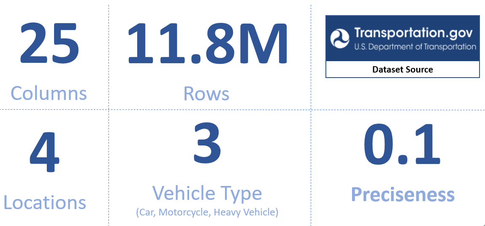
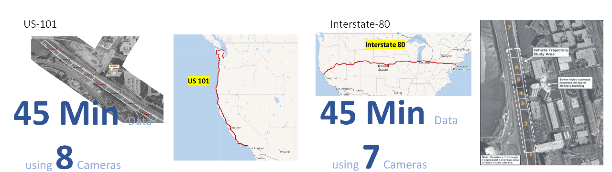
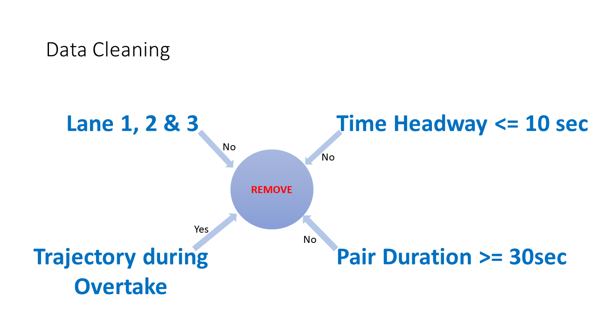
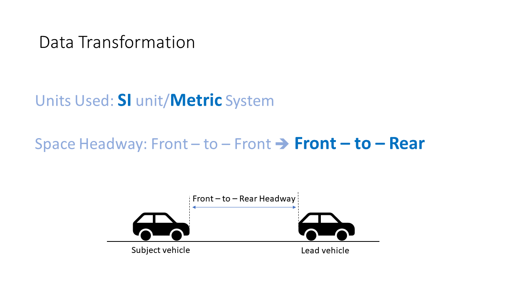

```{r setup, include=FALSE}
knitr::opts_chunk$set(echo = TRUE)
```


<p align="center"> 
   width="70%" height="70%">
</p>


<!-- TABLE OF CONTENTS -->
<h2 id="table-of-contents"> &#x1F4D8; Table of Contents</h2>

<details open="open">
  <summary>Table of Contents</summary>
  <ol>
    <li>
      <a href="#about-the-project"> ➤ About The Project</a>
      <ul>
        <li><a href="#Problem-statement">Problem Statement</a></li>
        <li><a href="#Proposed-Solution">Proposed Solution</a></li>
      </ul>
    </li>
    <li><a href="#prerequisites"> ➤ Prerequisites</a></li>
    <li><a href="#dataset"> ➤ Dataset</a></li>
    <li><a href="#roadmap"> ➤ Roadmap</a></li>
    <li>
      <a href="#preprocessing"> ➤ Preprocessing</a>
      <ul>
        <li><a href="#Data-Cleanup">Data Cleanup</a></li>
        <li><a href="#Data-Transormation">Data Transormation</a></li>
      </ul>
    </li>
    <li><a href="#results-and-discussion"> ➤ Results and Discussion</a></li>
    <li><a href="#TroubleShoot"> ➤ TroubleShoot</a></li>
    <li><a href="#contributors"> ➤ Contributors</a></li>
    
  </ol>
</details>


<!-- ABOUT THE PROJECT -->
<h2 id="about-the-project"> &#x270E; About The Project</h2>

<p align="justify"> 
  This project aims to understand and explore trajectories of various Car Following Models that predict Acceleration. The raw NGSIM data will be preprocessed to cleanup bad data and filter only valid pairs that would help train the model on I-80 and US-101 Highways. 
  The goal is to compare and evaluate the performance of different Models (Random Forest, k Nearest Neighbors, and CNN) and discuss the trajectories along with their R^2 and RMSE.
</p>
<!-- PRE-PROCESSED DATA -->
<h2 id="Problem-statement"> 💠 Problem Statement</h2>

<p align="justify"> 

* Very few data driven models predict acceleration accurately. 
*  Even with good RMSE scores, the trajectories do not match or aren’t displayed.
* The papers either falsely claim good acceleration predictions or completely avoid mentioning it.

</p>
<!-- PRE-PROCESSED DATA -->
<h2 id="Proposed-Solution"> 💠 Proposed Solution</h2>

<p align="justify"> 

 - Create and compare Data Driven car following model using NGSIM dataset.
 - Display and compare trajectories along with R2 and RMSE.

</p>


<!-- PREREQUISITES -->
<h2 id="prerequisites"> &#127860; Prerequisites</h2>

[](https://www.python.org/) <br>
[](https://jupyter.org/try) <br>
[](https://code.visualstudio.com/) <br>

<!--This project is written in Python programming language. <br>-->
The following open source packages are used in this project:
* Numpy
* Pandas
* TensorFlow
* Keras
* Matplotlib
* Sklearn
* pathlib
* random
* seaborn
* pickle
* streamlit


<!-- DATASET -->
<h2 id="dataset"> &#128190; Dataset</h2>
<p> 
  The dataset used in this project is called * Next Generation Simulation (NGSIM) * and it is publicly available on the U.S. Department of Transportation website. The NGSIM dataset consists of 25 columns and 11.8 million rows of vehicle trajectory data which was captured using a network of synchronized digital video cameras on 4 different locations (US 101, I-80, Peachtree, and Lankershim). The data contains the location of a vehicle at every one-tenth of a second, which gives the exact position of each vehicle relative to other vehicles. 
  A total of 3 different types of vehicle data can be found in this dataset, namely Car, Truck, and Motorcycle. Most of the data were taken from the two freeways i.e., US 101 and I-80, and among the three vehicle types, data on Cars is more as compared to Trucks and Motorcycles. Therefore, we decided to work on only the Freeways. After the Preliminary analysis, we found that some vehicle IDs are present in more than one location meaning that the data from all four locations were taken separately and then merged in a single file. Hence, we separated the data based on location to carry out data cleaning and data transformation and then merge them back. 

<p align="center">
  
</p>

<p align="center">
  
</p>

 _The NGSIM dataset is publicly available. Please refer to the [Link](https://www.opendatanetwork.com/dataset/data.transportation.gov/8ect-6jqj)_ 

</p>


<!-- ROADMAP -->
<h2 id="roadmap"> &#9945; Roadmap</h2>

<p align="justify"> 
  We trained three models namely k-Nearest Neighbors, Random Forest, and CNN to predict Acceleration for Subject Vehicle and find rest of the trajectory.
  The goals of this project include the following:
<ol>
  <li>
    <p align="justify"> 
      Clean and Transform the NGSIM Data 
    </p>
  </li>
  <li>
    <p align="justify"> 
      Train Random Forest, KNN and CNN on same Train Data. 
    </p>
  </li>
  <li>
    <p align="justify"> 
      Compare R2 and RMSE for the models. 
    </p>
  </li>
  <li>
    <p align="justify"> 
      Validate Vehicle Trajectories and compare with R2 and RMSE outcomes.
    </p>
  </li>
</ol>
</p>


<!-- PREPROCESSING -->
<h2 id="preprocessing"> &#128296; Preprocessing</h2>

<p align="justify"> 
  The NGSIM (Next Generation Simulation) dataset includes vehicle trajectory details along with the information of Lead and Following vehicle IDs. Even though the dataset has been processed by the Transportation department there are quite a few instances of Bad Data and vehicle trajectories which wont help in training for a good Car following model. Thus, we have preprocessed the data as per below:
  


<!-- PRE-PROCESSED DATA -->
<h2 id="Data-Cleanup"> 💠 Data-Cleanup</h2>

<p align="justify"> 
  Below are the cleanup tasks that have been performed:

   - Remove all Vehicles which have bad Vehicle Length and Type. i.e. same vehicle having two vehicle Types in different pair information.
   - Remove first 5 seconds for a Pair when Lead Vehicle is overtaking. Last 5 from the pair which the vehicle is leaving(same vehicle was Subject in that scneario).
   - Remove Lane 4 and above as they are shoulders/ramps and exits. 
   - Remove trajectories which are less than 30 seconds. 
   - Remove vehicles with Time headway greater than 10 seconds. 
</p>

<p align="center">
  
</p>


<h2 id="Data-Transormation"> &#128310; Data Transformation</h2>

<p align="justify"> 
  Below are the transformation steps that have been followed:

   - Map Subject and Lead Vehicle information to have them on the same row. 
   - Convert the Feet information to Metric Metres.
   - Convert the Front - Front Space and Time Headway details to Lead Vehicle Rear Bumper to Subject Vehicle Front Bumper. 
   - Create per pair timing. 
</p>
<p align="center">
  
</p>


<!-- RESULTS AND DISCUSSION -->
<h2 id="results-and-discussion"> &#128269; Results and Discussion</h2>

<p align="justify">
  The overall accuracy score of personal and impersonal models are shown in the following tables. Some of the results we observed are similar to the results obtained by Weiss et.al and they are discussed below: <br>
</p>
<p align="justify">
<ul>
  <li>
    Random Forest with 150 Regressors had the best Trajectory.<br>
  </li>
  <li>
    KNN has the best results at hand with limited resources i.e. Local Machine.
  </li>
  <li>
    CNN has best R2 and RMSE but bad trajectories and missed prediction scales.
  </li>
  <li>
    All three models are able to meet the trajectory oscillations.
  </li>
</ul>
</p>

<p align="center">
  
</p>


<!-- CONTRIBUTORS -->
<h2 id="contributors"> &#128220; Contributors</h2>

<p>
  &#127891; <i>All participants in this project are Student of Post Graduate Diploma in <a href="https://www.stclaircollege.ca/programs/data-analytics-business">Data Analytics for Business</a> <b>@</b> <a href="https://www.stclaircollege.ca/">St Clair College</a></i> <br> <br>
   
  &#128102; <b>Vineet Dhamija</b> <br>
  &nbsp;&nbsp;&nbsp;&nbsp;&nbsp; Email: <a>VD17@myscc.ca</a> <br>
  &nbsp;&nbsp;&nbsp;&nbsp;&nbsp; GitHub: 
  <a href="https://github.com/VineetDhamija">@VineetDhamija</a> <br>

  &#128102; <b>Neel Chaudhari</b> <br>
  &nbsp;&nbsp;&nbsp;&nbsp;&nbsp; Email: <a>NC57@myscc.ca</a> <br>
  &nbsp;&nbsp;&nbsp;&nbsp;&nbsp; GitHub: 
  <a href="https://github.com/neelschaudhari000">@neelschaudhari000</a> <br>

  &#128102; <b>Rakesh Singh</b> <br>
  &nbsp;&nbsp;&nbsp;&nbsp;&nbsp; Email: <a>rs334@myscc.ca</a> <br>
  &nbsp;&nbsp;&nbsp;&nbsp;&nbsp; GitHub: 
  <a href="https://github.com/rakesh894">@rakesh894</a> <br>
  
  &#128102; <b>Umair Durrani</b> <br>
  &nbsp;&nbsp;&nbsp;&nbsp;&nbsp; Email: <a>UDURRANI@stclaircollege.ca</a> <br>
  &nbsp;&nbsp;&nbsp;&nbsp;&nbsp; GitHub: 
  <a href="https://github.com/durraniu">@durraniu</a> <br>
  
</p>

<br>
✤ <i>This was the final project for the course DAB402- Capstone (Summer 2022), at <a href="https://www.stclaircollege.ca/">St Clair College</a><i>